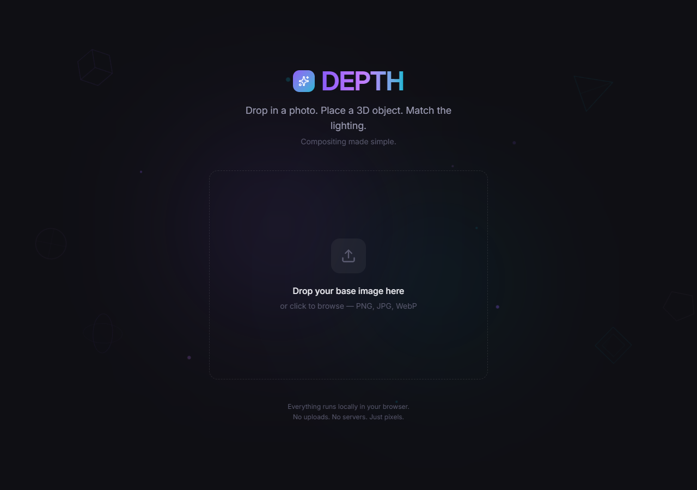
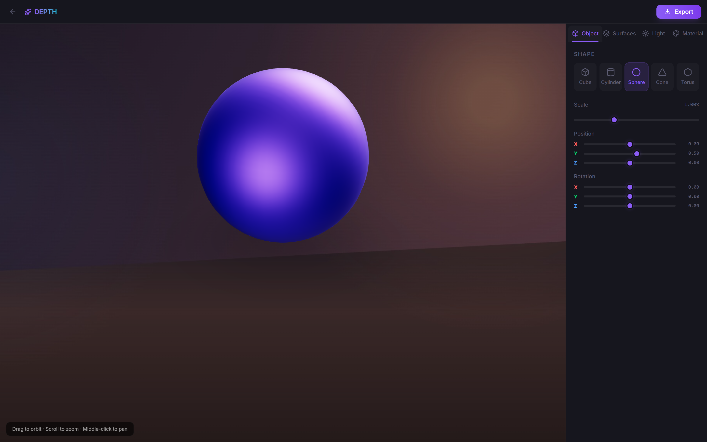
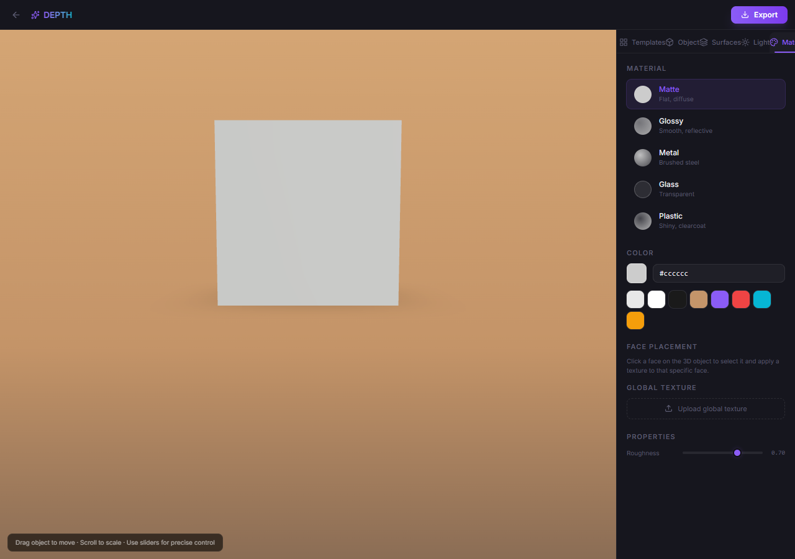
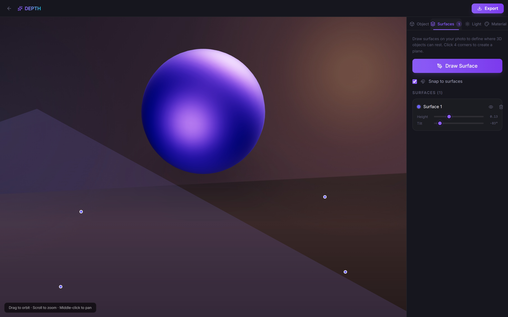

# Depth

**3D compositing engine for 2D images.** Drop in a photo, place a 3D object, match the lighting automatically.

Built for designers who need occasional 3D visuals without learning Blender — and for creative tool companies looking to embed 3D compositing into their products.

<p align="center">
  
</p>

<p align="center">
  
</p>

---

## Repository Structure

```
depth/
├── sdk/          C++ SDK — embeddable compositing engine
└── web/          Web prototype — React + Three.js demo app
```

### [`sdk/`](./sdk) — C++ SDK (the engine)

The core technology: a zero-dependency C++ library for compositing 3D objects onto background images with automatic lighting estimation.

- **Lighting estimation** — analyzes a photo to estimate light direction, color temp, brightness
- **Surface detection** — define collision planes from drawn quads for realistic object placement
- **3D rendering** — software rasterizer with z-buffer, per-pixel shading, and triangle mesh support
- **OBJ mesh loading** — import Wavefront OBJ files with automatic normal computation
- **Compositing** — alpha-over blending with Normal, Multiply, Screen, and Overlay modes
- **C + C++ APIs** — clean C++ interface with a flat C API for FFI/embedding in any language

```cpp
// 5 lines to composite a 3D object onto a photo
Scene scene;
scene.set_background(Image::load("photo.jpg"));
scene.apply_lighting_estimate(estimate_lighting(scene.background()));
scene.add_object({.geometry = GeometryType::Box, .transform = {.position = {0, 0.5f, 0}}});
render_composite(*Renderer::create(), scene).save("output.png");
```

### [`web/`](./web) — Web Prototype

Interactive browser demo built with React 19, Three.js (React Three Fiber), Zustand, and Tailwind CSS v4.

- Upload a background photo → auto-analyze lighting
- Pick from 5 primitive shapes, adjust position/scale/rotation
- Choose material presets (matte, glossy, metal, glass, plastic) with color swatches
- Draw surface planes on the image for object collision/snapping
- Fine-tune lighting direction, height, shadow, and color
- Export composite as PNG/WebP/JPEG (or copy to clipboard)

```bash
cd web && npm install && npm run dev
```

---

## Screenshots

| Upload | Editor | Materials |
|--------|--------|-----------|
|  |  |  |

| Lighting | Surfaces |
|----------|----------|
|  |  |

---

## Why Two Versions?

| | Web Prototype | C++ SDK |
|---|---|---|
| **Purpose** | Product validation, UX testing | Embeddable engine, acquisition asset |
| **Stack** | React + Three.js + TypeScript | C++20, zero dependencies |
| **Performance** | WebGL (~60-70% native) | Native GPU (Vulkan/Metal planned) |
| **Distribution** | URL — zero install | Static/dynamic library, C API |
| **Target** | End users (designers) | Host applications (Adobe, Canva, etc.) |

The web app proves the product works. The C++ SDK is what ships inside another company's product.

---

## Building

### SDK

```bash
cd sdk
cmake -B build -DCMAKE_BUILD_TYPE=Release
cmake --build build
./build/tests/depth_tests      # run tests
./build/examples/depth_demo    # run demo
```

### Web

```bash
cd web
npm install
npm run dev     # development server
npm run build   # production build
```

---

## License

Proprietary. All rights reserved.
